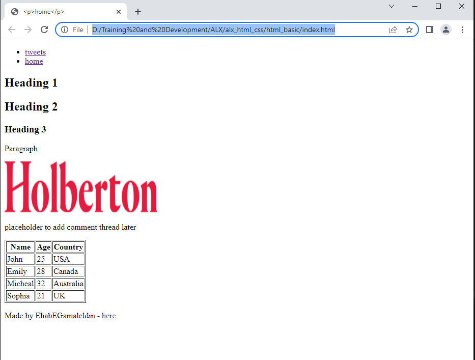

This is ALX HTML basics project, it consists of 3 HTML files, base_index, index, tweets.
There is a navigation in header and developer information in footer as common elements in index and tweets webpages

